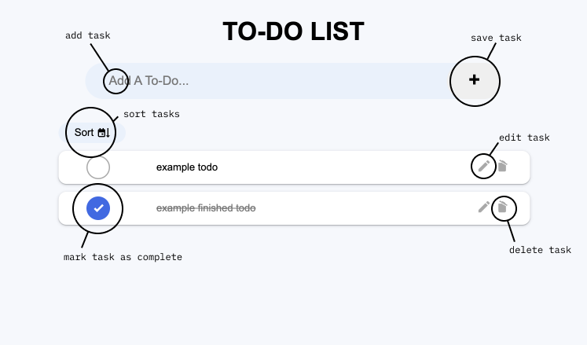

# To-Do List

Simple To-Do List Application that allows users to keep track of tasks. Created using HTML, CSS, JavaScript, and Svelte.

View deployed version, that was deployed using GH pages click [here](https://cwroberts401.github.io/to-do/).

## Running Project Locally

Download or Fork Repo, then:

```bash
# install dependencies
npm install

# start dev server
npm run dev -- --open
```

## Usage



- To create a new todo simpliy add your task and click the plus button.

- To edit a todo click the pencil icon on the right, edit, then click anywhere on screen to save changes.

- To delete a todo click the trash can icon on the right side of the task you wish to delete.

- To mark a todo as complete click the circle on the left side of todo. Clicking an already finished To-Do will set it as unfinished. 

- Sort, to sort by status click on sort button and select 'status'. defualt sort is by date (recent to oldest).
